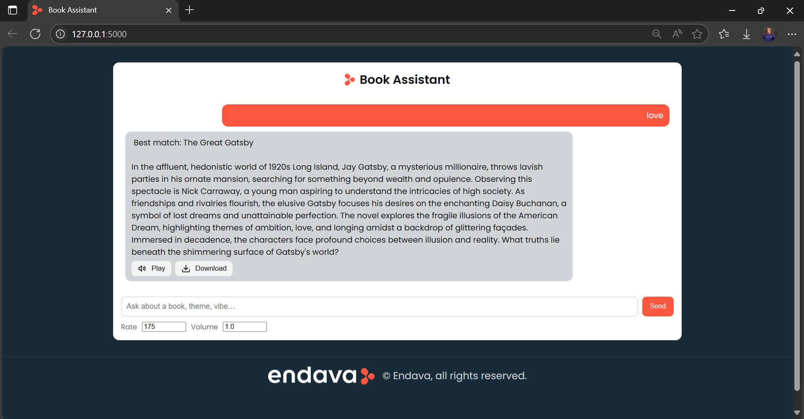

# Smart Librarian — Ollama + Flask (RAG + Tools)

Local book‑recommender chatbot that uses **ChromaDB** for semantic search, **Ollama** for embeddings, a simple **Flask** backend, and a lightweight web UI.  
Includes an exact‑title summary tool and optional Text‑to‑Speech (TTS) with **Play** and **Download** in the UI.

> This project implements the assignment using a fully local stack (no OpenAI embeddings).



## ✨ Features (assignment mapping)

- **Books dataset (10+ titles)** in `books_prompt_result.json`.
- **Vector store** with **ChromaDB**.
- **Embeddings via Ollama** (`nomic-embed-text`) – no OpenAI dependency.
- **Chat endpoint** that:
  - blocks inappropriate language (polite message, no LLM call),
  - runs semantic search,
  - returns *Best match: <title>* plus the **full summary** from local JSON.
- **Tool: `get_summary_by_title(title)`** — exact, case-insensitive title lookup.
- **Text‑to‑Speech (optional)** — `/tts` returns WAV audio; UI exposes **Play** / **Download** buttons.
- **Frontend** — clean Flask template (`templates/chat.html`) served at `/` (chat style similar to ChatGPT).


## 🧱 Project structure

```
project/
├─ app.py                   # Flask API + RAG + TTS + exact‑title tool (run this)
├─ templates/
│  └─ chat.html             # Web UI (chat + Play/Download + footer)
├─ static/                  # Icons / images (favicon, logo, optional svg)
│  ├─ endava_symbol_RGB.png
│  ├─ endava_logo_pos_RGB.png (or _neg_)
│  ├─ send.svg, audio.svg   (optional)
├─ books_prompt_result.json # 10+ books with titles & summaries
├─ bad_words.json           # curated list used by the polite language filter
|─ snippets/
|  ├─ ollama.py             # (optional) CLI demo for embeddings/TTS (openAI key didn't work)
|  └─ openAPI.py            # (reference) earlier OpenAI-based attempt 
```


## 💻 Prerequisites

- Python **3.10+**
- **Ollama** installed and running (`ollama serve` usually starts the daemon)
- Pull the embedding model once:
  ```bash
  ollama pull nomic-embed-text
  ```
- Python dependencies:
  ```bash
  pip install flask flask-cors chromadb requests pyttsx3
  ```
  > On Linux you may also need: `sudo apt-get install espeak-ng libespeak-ng1` for TTS.


## 🚀 Run

1. Start the backend:
   ```bash
   python app.py
   ```
   - Loads `books_prompt_result.json`
   - Embeds with Ollama (`nomic-embed-text`)
   - Indexes in ChromaDB and serves the UI at **http://127.0.0.1:5000/**

2. Open your browser at **http://127.0.0.1:5000/**
   - Type queries like *“friendship and magic”*, *“war”*, *“dystopia”*.
   - After a recommendation appears, use **Play** to listen or **Download** to save the audio.


## 🔌 API endpoints (quick test)

- `POST /chat`
  ```json
  { "message": "friendship and magic" }
  ```
  → `{ "reply": "Best match: …\n\n<full summary>" }`

- `GET /summary?title=1984`
  → `{ "title": "1984", "summary": "…" }` (404 if not found)

- `POST /search`
  ```json
  { "query": "war", "k": 3 }
  ```
  → `{ "results": [ { "title": "...", "score": 123.4, "summary_snippet": "…" } ] }`

- `POST /tts`
  ```json
  { "text": "Hello", "rate": 175, "volume": 1.0 }
  ```
  → WAV audio stream


## ⚙️ Configuration

- **Ollama host:** set env var `OLLAMA_HOST` (default `http://localhost:11434`).
- **Bad words list:** edit `bad_words.json` (curated list of strings).
- **Add books:** append items to `books_prompt_result.json` with `"title"` and `"summary"` then restart.
- **Branding:** favicon/logo are in `static/`; footer markup is in `templates/chat.html`.


## 🆘 Troubleshooting

- **`{ "models": [] }` or connection error**  
  Ensure Ollama is running and model is pulled: `ollama serve` + `ollama pull nomic-embed-text`.

- **TTS error (HTTP 500 / “TTS not available”)**  
  Install TTS deps: `pip install pyttsx3`. On Linux: `sudo apt-get install espeak-ng libespeak-ng1`.

- **Static files 404 (icons/fonts)**  
  Assets must live under `static/` and be referenced via `url_for('static', filename='…')` in the template.


## 📄 License / Notes

Educational demo for the “Smart Librarian – RAG + Tools” assignment.  
Book summaries are short educational descriptions; rights remain with their authors/publishers.

---

**Author:** Olaru Ariana-Casandra
**Tech:** Flask • ChromaDB • Ollama (`nomic-embed-text`) • pyttsx3